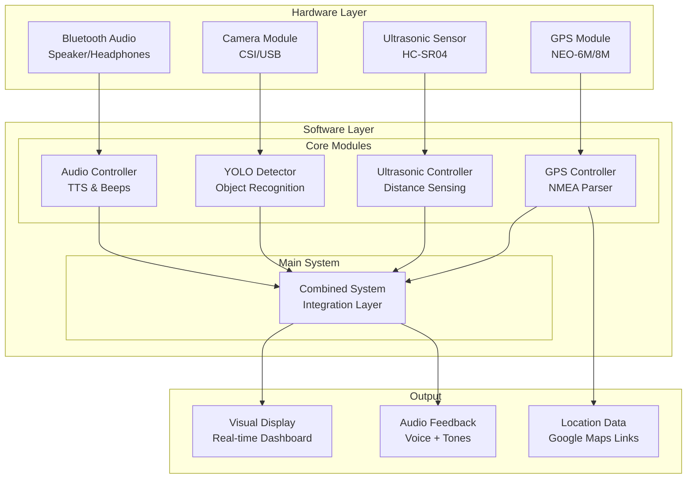

# Newnavsight 🧭

[](https://python.org)
[](https://raspberrypi.org)
[](LICENSE)

## Overview

**Newnavsight** is a comprehensive navigation assistance system designed for Raspberry Pi 5, combining multiple sensing technologies to provide enhanced situational awareness and navigational guidance. The system integrates GPS positioning, ultrasonic proximity detection, and AI-powered computer vision to create a robust navigation aid suitable for accessibility applications, robotics, and autonomous systems.

## System Architecture



## Key Features

### 🛰️ **Precision GPS Tracking**
- **Real-time positioning** with NMEA sentence parsing
- **Satellite status monitoring** with signal strength visualization
- **Google Maps integration** for instant location sharing
- **Fix quality assessment** with troubleshooting guidance
- **Dashboard interface** showing coordinates, altitude, speed, and heading

### 📡 **Proximity Detection System**
- **Ultrasonic distance sensing** with HC-SR04 sensor
- **Multi-zone audio alerts** with distance-based frequency modulation
- **Real-time visual feedback** with color-coded distance bars
- **Bluetooth audio support** for wireless notification delivery
- **Configurable alert thresholds** for different use cases

### 🤖 **AI-Powered Object Detection**
- **YOLOv8 integration** for real-time object recognition
- **Multi-class detection** with confidence scoring
- **Audio announcements** via text-to-speech synthesis
- **Visual overlay** with bounding boxes and labels
- **Optimized for Raspberry Pi** with frame rate optimization

### 🔊 **Advanced Audio System**
- **Multi-method audio support**: PulseAudio, ALSA, Sox
- **Bluetooth compatibility** with automatic device detection
- **Text-to-speech synthesis** using espeak, pico2wave, or festival
- **Adaptive beep patterns** based on proximity zones
- **Audio queue management** for prioritized alerts

## Hardware Requirements

### Essential Components
- **Raspberry Pi 5** (4GB+ RAM recommended)
- **GPS Module**: NEO-6M, NEO-8M, or compatible UART GPS
- **Ultrasonic Sensor**: HC-SR04 or equivalent
- **Camera**: Raspberry Pi Camera Module v2/v3 or USB webcam

### Optional Components
- **Bluetooth Speaker/Headphones** for wireless audio
- **External GPS Antenna** for improved signal reception
- **Breadboard and Jumper Wires** for prototyping

### Wiring Diagram

```
┌─────────────────────────────────────────────────┐
│                Raspberry Pi 5                   │
│                                                 │
│  GPIO Pins:                                     │
│  ┌─ Pin 1  (3.3V)  ────────────── GPS VCC      │
│  ├─ Pin 6  (GND)   ────────────── GPS GND      │
│  ├─ Pin 8  (TX)    ────────────── GPS RX       │
│  ├─ Pin 10 (RX)    ────────────── GPS TX       │
│  │                                              │
│  ├─ Pin 11 (GPIO17) ─────────── (Optional)     │
│  ├─ Pin 16 (GPIO23) ─────────── US Trig        │
│  ├─ Pin 18 (GPIO24) ─────────── US Echo        │
│  └─ Pin 20 (GND)   ────────────── US GND       │
│                                                 │
│  CSI Connector ─────────────── Camera Module   │
│  USB Ports ─────────────────── USB Camera      │
│  Bluetooth ─────────────────── Audio Device    │
└─────────────────────────────────────────────────┘
```

## Installation

### 1. System Prerequisites
```bash
# Update system packages
sudo apt update && sudo apt upgrade -y

# Install Python dependencies
sudo apt install python3-pip python3-dev python3-serial -y

# Install audio system components
sudo apt install pulseaudio pulseaudio-utils alsa-utils -y
sudo apt install espeak festival libttspico-utils sox -y

# Install camera dependencies (for CSI camera)
sudo apt install python3-picamera2 -y
```

### 2. Python Dependencies
```bash
# Clone the repository
git clone https://github.com/robofan45/Newnavsight.git
cd Newnavsight

# Install Python packages
pip3 install -r requirements.txt

# Install core dependencies manually if needed
pip3 install lgpio numpy opencv-python ultralytics
```

### 3. Hardware Configuration
```bash
# Enable serial interface for GPS
sudo raspi-config nonint do_serial 2
sudo systemctl disable serial-getty@serial0.service

# Enable camera interface
sudo raspi-config nonint do_camera 0

# Add to /boot/firmware/config.txt
echo "enable_uart=1" | sudo tee -a /boot/firmware/config.txt
echo "camera_auto_detect=1" | sudo tee -a /boot/firmware/config.txt

# Reboot to apply changes
sudo reboot
```

## Usage

### GPS System
```bash
# Run GPS diagnostic and location finder
python3 GPS.py

# Start GPS dashboard with real-time monitoring
python3 rpi_gps_controller.py
```

### Ultrasonic Proximity System
```bash
# Run ultrasonic sensor with audio alerts
python3 Ultrasonic.py

# Setup Bluetooth audio (optional)
python3 Ultrasonic.py --bluetooth

# Install audio dependencies
python3 Ultrasonic.py --install
```

### Combined Navigation System
```bash
# Run complete integrated system
python3 combined_ultrasonic_yolo.py

# Install audio dependencies
python3 combined_ultrasonic_yolo.py --install-audio

# Test audio system
python3 combined_ultrasonic_yolo.py --test-audio
```

### Runtime Controls
- **`q`** - Quit application
- **`t`** - Test audio system
- **`y`** - Toggle YOLO audio announcements

## System Operation

### GPS Dashboard
The GPS system provides real-time monitoring with:
- **Coordinate Display**: Latitude/longitude with 6-decimal precision
- **Satellite Tracking**: Signal strength bars for up to 12 satellites
- **Fix Quality Indicators**: Visual status with color coding
- **Google Maps Integration**: Automatic link generation for location sharing

### Proximity Alert Zones
| Distance Range | Alert Level | Beep Frequency | Audio Pattern |
|----------------|-------------|----------------|---------------|
| < 10cm         | DANGER      | 2000Hz         | Continuous (50ms intervals) |
| 10-20cm        | VERY CLOSE  | 1500Hz         | Fast (150ms intervals) |
| 20-40cm        | CLOSE       | 1200Hz         | Medium (300ms intervals) |
| 40-70cm        | MEDIUM      | 1000Hz         | Slow (600ms intervals) |
| 70-100cm       | FAR         | 800Hz          | Very slow (1s intervals) |
| > 100cm        | SAFE        | None           | Silent |

### Object Detection Classes
The YOLO system can detect and announce:
- **People**: Pedestrians, individuals
- **Vehicles**: Cars, trucks, bicycles, motorcycles  
- **Obstacles**: Barriers, poles, signs
- **Animals**: Dogs, cats, birds
- And 80+ additional object classes

## Configuration

### GPS Configuration (`rpi_gps_controller.py`)
```python
class GPSConfig:
    SERIAL_PORT = '/dev/serial0'
    BAUD_RATE = 9600
    UPDATE_RATE_HZ = 1.0
    STALE_DATA_THRESHOLD_S = 5
```

### Audio Configuration
```python
# Supported audio backends (auto-detected)
AUDIO_METHODS = ['pulse', 'sox', 'alsa']
TTS_METHODS = ['espeak', 'pico2wave', 'festival']
```

### Camera Configuration
```python
# Default camera settings
FRAME_WIDTH = 640
FRAME_HEIGHT = 480
CAMERA_TYPE = 'csi'  # or 'usb'
```

## Troubleshooting

### GPS Issues
```bash
# Check serial port permissions
ls -la /dev/serial0

# Test raw GPS data
sudo cat /dev/serial0

# Verify GPS wiring and power
python3 GPS.py  # Runs diagnostic wizard
```

### Audio Issues
```bash
# Test PulseAudio
pactl info

# Check Bluetooth connections
bluetoothctl devices Connected

# Test speaker output
speaker-test -t wav -c 2 -l 1
```

### Camera Issues
```bash
# List available cameras
v4l2-ctl --list-devices

# Test camera capture
libcamera-still -o test.jpg
```

## API Reference

### GPSController Class
```python
gps = GPSController(config)
gps.start()                    # Begin GPS monitoring
data = gps.get_current_data()  # Get latest GPS data
gps.send_command("PMTK220,1000")  # Send NMEA command
gps.stop()                     # Stop monitoring
```

### UltrasonicSensor Class
```python
sensor = UltrasonicSensor(trig_pin=23, echo_pin=24)
sensor.start_monitoring(audio_controller)
distance = sensor.current_distance  # Get current reading
sensor.cleanup()
```

### YOLODetector Class
```python
detector = YOLODetector(model_path="yolov8n.pt")
detector.start_detection(audio_controller)
detections = detector.current_detections
detector.cleanup()
```

## Contributing

We welcome contributions to enhance Newnavsight! Please follow these guidelines:

1. **Fork** the repository
2. **Create** a feature branch (`git checkout -b feature/amazing-feature`)
3. **Commit** your changes (`git commit -m 'Add amazing feature'`)
4. **Push** to the branch (`git push origin feature/amazing-feature`)
5. **Open** a Pull Request

### Development Setup
```bash
# Install development dependencies
pip3 install black flake8 pytest

# Run code formatting
black *.py

# Run linting
flake8 *.py

# Run tests
pytest tests/
```

## Performance Specifications

| Component | Metric | Performance |
|-----------|--------|-------------|
| GPS | Update Rate | 1-10 Hz |
| GPS | Fix Accuracy | 3-5 meters |
| Ultrasonic | Range | 2-400 cm |
| Ultrasonic | Update Rate | 20 Hz |
| YOLO | Frame Rate | 10-30 FPS |
| YOLO | Detection Classes | 80+ objects |
| Audio | Latency | < 100ms |

## License

This project is licensed under the MIT License - see the [LICENSE](LICENSE) file for details.

## Acknowledgments

- **Ultralytics** for the YOLOv8 object detection framework
- **Raspberry Pi Foundation** for the excellent hardware platform
- **NMEA Standards** for GPS communication protocols
- **OpenCV Community** for computer vision tools

## Support

For support, feature requests, or bug reports:
- **GitHub Issues**: [Create an issue](https://github.com/robofan45/Newnavsight/issues)
- **Documentation**: Check the inline code documentation
- **Community**: Join discussions in the repository

---

**Built with ❤️ for enhanced navigation and accessibility**

*Newnavsight - Providing clear vision for navigation challenges*
